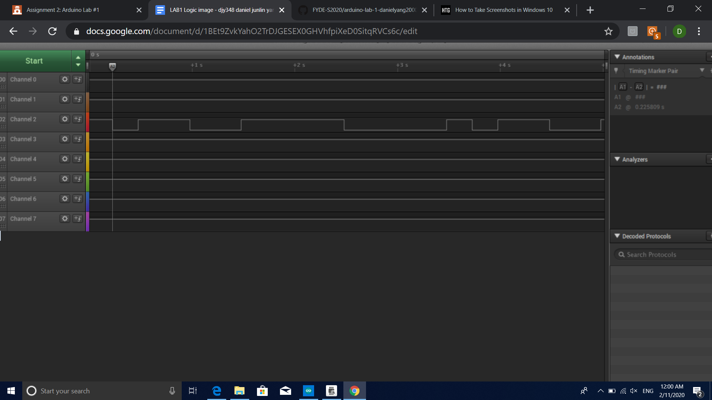

Name: daniel yang

EID: djy348

Team Number:f13

## Questions

1. Why does your program need a setup and a loop?

    set up is needed to initialize the program and variables and loop has the codes that the program runs forever unless the program is stopped

2. What is the downside to putting all your code in a loop?

   Putting all the code in a loop will mostly likely make it difficult to debug if problems pop up

3. Why does your code need to be compiled?

    the code is compiled so that the computer can understand the language and run the program

4. When lowering the frequency in procedure A, step 4, what is going wrong? Brainstorm some solutions. Dimmers exist in the real world. What is their solution?

    the LED starts to flick constantly when the frequency is lowered

5. Why do you need to connect the logic analyzer ground to the ESP32 ground?

    so that it forms a circuit

6. What is the difference between synchronous and asynchronous communication?

    your answer here

7. Profile of UART: Sent X bytes in Y time 

    your answer here

8. Profile of SPI: Sent X bytes in Y time

    your answer here

9. Why is SPI so much faster than UART?

    your answer here

10. list one pro and one con of UART

    your answer here

11. list one pro and one con of SPI

    your answer here

12. list one pro and one con of I2C

    your answer here

13. Why does I2C need external resistors to work?

    your answer here

## Screenshots

Procedure A, step 1:

Procedure A, step 4:

Procedure B, UART:

Procedure B, SPI:

