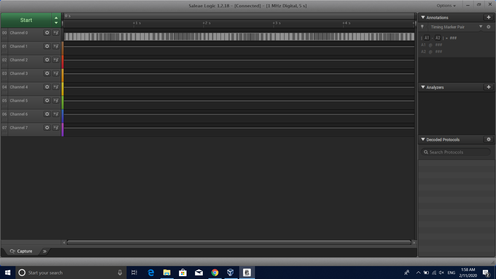
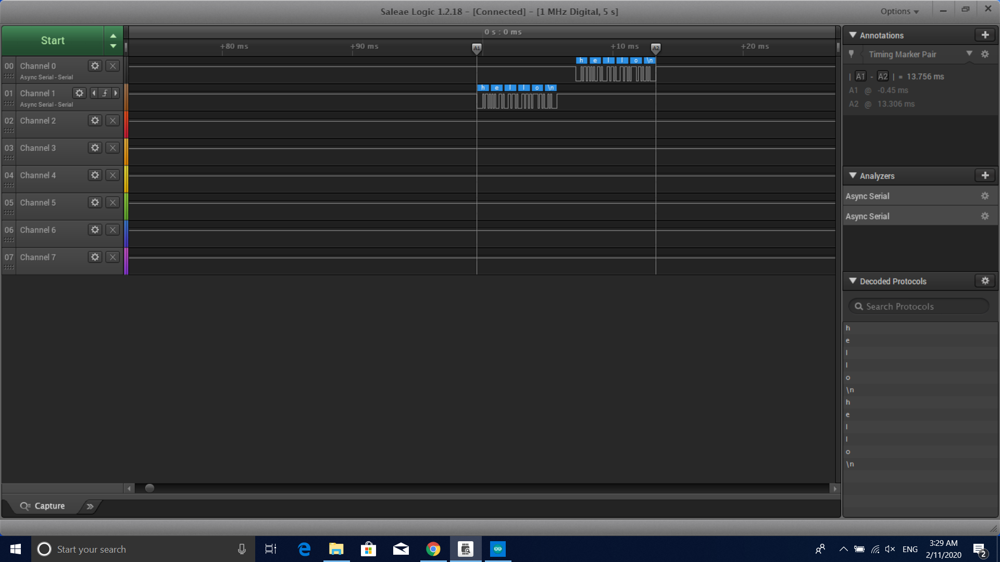
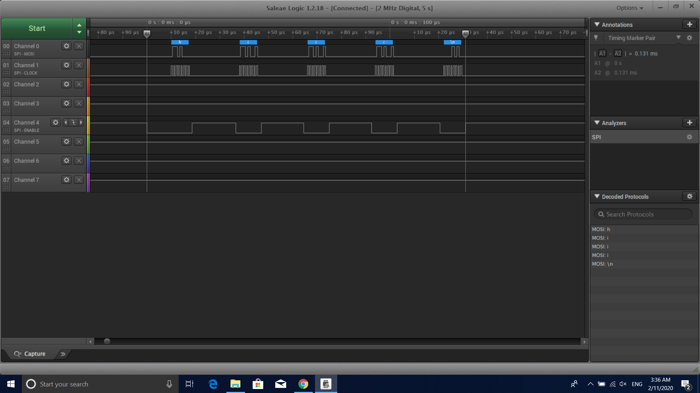

Name: daniel yang

EID: djy348

Team Number:f13

## Questions

1. Why does your program need a setup and a loop?

    set up is needed to initialize the program and variables and loop has the codes that the program runs forever unless the program is stopped

2. What is the downside to putting all your code in a loop?

   Putting all the code in a loop will mostly likely make it difficult to debug if problems pop up

3. Why does your code need to be compiled?

    the code is compiled so that the computer can understand the language and run the program

4. When lowering the frequency in procedure A, step 4, what is going wrong? Brainstorm some solutions. Dimmers exist in the real world. What is their solution?

    the LED starts to flick constantly when the frequency is lowered. One of the solution is to increase the frequency so that LED doesn't flick noticeably.Real dimmers change the voltage waveform applied to the LED

5. Why do you need to connect the logic analyzer ground to the ESP32 ground?

    so that logic analyzer can have a reference to the ground voltage of the ESP32 and closes the circuit 

6. What is the difference between synchronous and asynchronous communication?

    Synchronous communication means that two or more people exchange information in real-time.Asynchronous communication refers to the exchange of data between two or more people without the requirement for all the recipients to respond immediately.

7. Profile of UART: Sent X bytes in Y time 

    sent 5 bytes in 13.756ms

8. Profile of SPI: Sent X bytes in Y time

    snet 5 bytes in .131ms

9. Why is SPI so much faster than UART?

    SPI is synchronous while UART is asynchronous

10. list one pro and one con of UART

    UART required less wires but it's slower compared to SPI

11. list one pro and one con of SPI

    SPI is really fast but requires more wires

12. list one pro and one con of I2C

    I2C uses only 2 pins but it need external resistors

13. Why does I2C need external resistors to work?

    I2c's wires are open drain and thus pull up and pull down resistors are needed

## Screenshots

Procedure A, step 1:

Procedure A, step 4:

Procedure B, UART:

Procedure B, SPI:

